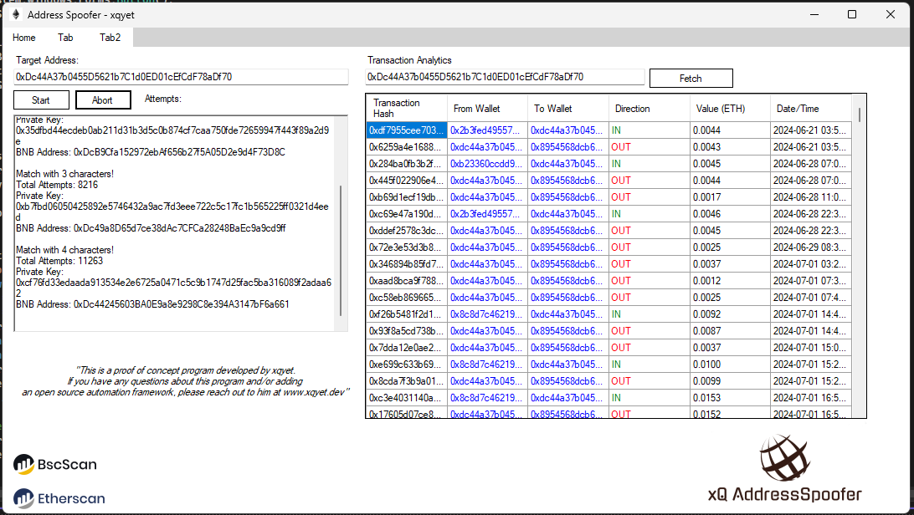

# Blockchain Address Spoofer Tool

A C# WinForms application that generates target wallet addresses based on initial prefix and grabs from Ethereum transaction history. developed by [xqyet](https://xqyet.dev/).


---
## Interface



## Features

- **Address Generation:** Search for wallet addresses matching prefix characters. Displays best matches in order of matched characters
- **Transaction Analytics:** Fetch and display transaction history for any Ethereum & Binance address.

## Requirements

- [.NET Framework](https://dotnet.microsoft.com/download/dotnet-framework) (4.8 or later)
- Packages:
  - `Newtonsoft.Json`
  - `Nethereum`
  - `System.Net.Http`

---

## Installation

1. Clone the repository:
   ```bash
   git clone https://github.com/username/AddressSpoofer.git
'''
2. Open the project in Visual Studio.

3. Restore NuGet packages by navigating to the **Solution Explorer** and right-clicking the project, then selecting **Manage NuGet Packages** -> **Restore**.

## How to use

1. **Generate Address:**
   - Enter the target wallet address in the input field.
   - Click **Start** to search for matching addresses.
   - Click **Abort** to stop searching. 

2. **Fetch Transactions:**
   - Enter an Ethereum address in the **Analytics** section.
   - Click **Fetch Transactions** to load transaction history in the table.

## Code Structure

- **Form1.cs**: Main application logic, including the address generator and API calls.
- **Form1.Designer.cs**: UI components and layout.

## License

MIT License
